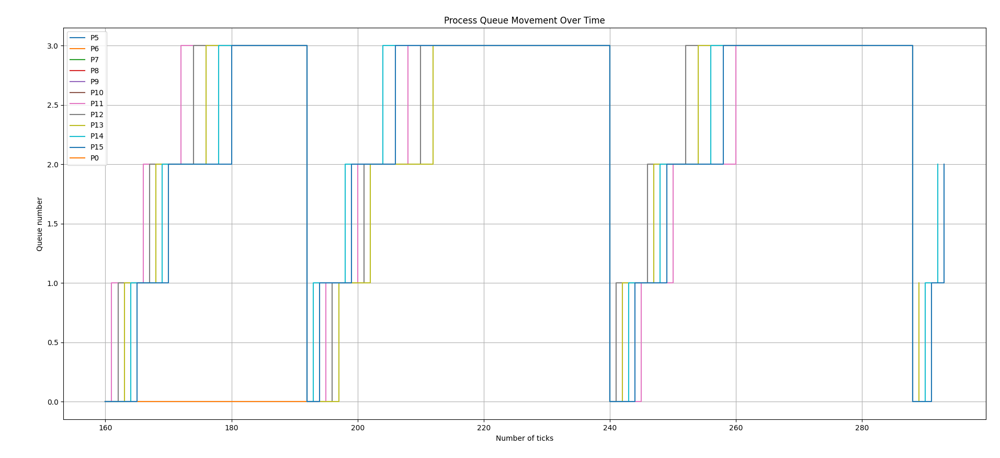

# System Calls

### GOTTA COUNT 'EM ALL
Changes made are as follows:
A new system call called `getSysCount` is implemented which tracks the number of times a specific system call is invoked during execution of a process and its children(Mask is transferred from parent to child to handle this). A corresponding user program, `syscount` has been created that allows users to call system call prints the total count along with the system call name and PID of the process.

Makefile: 
```C
Added  $U/_syscount\ 
```

---

usys.pl
```C
Added  entry("getsyscount");  
```

---

user.h
```C
Added  int getsyscount(int); 
```

---

defs.h
```C
Added  int getsyscount(int); 
```

---

syscall.c
```C
Added  extern uint64 sys_getsyscount(void);, 
Added  [SYS_getsyscount] sys_getsyscount;
Added: int get_syscall_index(int mask) {
  for (int i = 0; i < 32; i++) {
    if (mask == (1 << i)) {
      return i;
    }
  }
  return -1;
}
```

---

syscall.h
```C
Added  #define SYS_getsyscount 23
```

---

sysproc.c
```C
Added: uint64 sys_getsyscount(void)
{
  int mask;
  argint(0, &mask);

  struct proc *p = myproc();
  int index = get_syscall_index(mask);
  if (index != -1) {
    index = p->syscalls[index]; 
  }
  index = get_syscall_index(mask);
  if (index == -1) return -1;
  int count = getsyscount(mask);
  return count;
}
```

---

proc.h
```C
Added: int get_syscall_index(int mask);, 
int syscalls[syscalls_MAX]; in struct proc
```

---

proc.c
```C
Added: int getsyscount(int mask)
{
  struct proc *p = myproc();
  int index = get_syscall_index(mask);
  if (index == -1) {
    return -1;
  }
  return p->syscalls[index];
}

memset(p->syscalls, 0, sizeof(p->syscalls)); in allocproc()
```

---

Created user/syscount.c
```C
#include "kernel/types.h"
#include "kernel/stat.h"
#include "user/user.h"
#include "kernel/syscall.h"
#define NELEM(x) (sizeof(x)/sizeof((x)[0]))

char* syscall_name(int mask) {
    static char* syscalls[] = {
        "fork", "exit", "wait", "pipe", "read", "kill", "exec", "fstat",
        "chdir", "dup", "getpid", "sbrk", "sleep", "uptime", "open", "write",
        "mknod", "unlink", "link", "mkdir", "close", "waitx", "getsyscount"
    };
    int index = -1;
    while (mask > 1) {
        mask /= 2;  
        index++;
    }
    if (index >= 0 && index < NELEM(syscalls)) return syscalls[index];
    return "unknown";
}

int main(int argc, char *argv[]) {
  if (argc < 3) {
    printf("Usage: syscount <mask> command [args]\n");
    exit(1);
  }
  int mask = atoi(argv[1]);
  if ((mask & (mask - 1)) != 0) {
      printf("Invalid mask %d\n", mask);
      exit(1);
  }
  int pid = fork();
  if (pid < 0) {
    printf("Couldn't execute fork\n");
    exit(1);
  }
  if (pid == 0) {    
    exec(argv[2], &argv[2]);
    printf("Couldn't execute exec\n");
    exit(1);
  } 
  else {    
    wait(0);
    int count = getsyscount(mask);
    printf("PID %d called %s %d times\n", pid, syscall_name(mask), count);
  }
  exit(0);
}
```


### WAKE ME UP WHEN TIMER ENDS
Implementing `sigalarm(interval, handler)` system call that allows processes to receive periodic alarms based on the time they consume. It lets a process specify time(ticks) after which a `handler` will be called by the kernel. It thus simulates user-level signal handling similar to interrupts. Another system call, `sigreturn()` allows the process to resume its normal execution after the handler finishes, restoring the process state. The fields `alarm_interval`, `alarm_handler`, and `alarm_trapframe` manage the alarm's state. We also tracks CPU ticks for each process, and when the specified interval elapses, the kernel invokes the handler.

Changes made are as follows:

Makefile: 
```C
Added  $U/_alarmtest\
```

---

usys.pl
```C
Added  entry("sigalarm");, entry("sigreturn"); 
```

---

user.h
```C
Added  int sigalarm(int interval, void (*handler)());
and int sigreturn(void); 
```

---

syscall.h
```C
Added  #define SYS_sigalarm 24 , #define SYS_sigreturn 25
```

---

syscall.c
```C
Added extern uint64 sys_sigalarm(void); , 
extern uint64 sys_sigreturn(void);

Added [SYS_sigalarm] sys_sigalarm,
[SYS_sigreturn] sys_sigreturn,
```

---


proc.c
```C
Added int
sigalarm(int interval, void (*handler)())
{
  struct proc *p = myproc();
  p->alarm_interval = interval;
  p->alarm_handler = (uint64)handler;
  memset(&p->ticks_count, 0, sizeof(p->ticks_count));
  if (interval > 0) p->alarm_on = 1;
  else p->alarm_on = 0;
  return 0;
}

int
sigreturn(void)
{
  struct proc *p = myproc();
  if(p->alarm_trapframe == 0)
    return -1;
  memmove(p->trapframe, p->alarm_trapframe, sizeof(struct trapframe));
  kfree(p->alarm_trapframe);
  memset(&p->alarm_trapframe, 0, sizeof(p->alarm_trapframe));
  return 0;
}

memset(&p->ticks_count, 0, sizeof(p->ticks_count));
memset(&p->alarm_on, 0, sizeof(p->alarm_on));
memset(&p->alarm_interval, 0, sizeof(p->alarm_interval));
memset(&p->alarm_handler, 0, sizeof(p->alarm_handler));
memset(&p->alarm_trapframe, 0, sizeof(p->alarm_trapframe)); in allocproc()
```

---

sysproc.c
```C
Added  uint64 sys_sigalarm(void)
{
  int interval;
  argint(0, &interval);
  uint64 handler;
  argaddr(1, &handler);
  struct proc *p = myproc();
  memset(&p->ticks_count, 0, sizeof(p->ticks_count));
  if (interval > 0) p->alarm_on = 1;
  else p->alarm_on = 0;
  p->alarm_interval = interval;
  p->alarm_handler = handler;
  if (p->alarm_trapframe) {
    kfree(p->alarm_trapframe);
    memset(&p->alarm_trapframe, 0, sizeof(p->alarm_trapframe));
  }
  return 0;
}

and

uint64
sys_sigreturn(void)
{
  struct proc *p = myproc();
  if (p->alarm_trapframe) {
    memmove(p->trapframe, p->alarm_trapframe, sizeof(struct trapframe));
    kfree(p->alarm_trapframe);
    memset(&p->alarm_trapframe, 0, sizeof(p->alarm_trapframe));
    return 0;
  }
  return -1;
}
```

# Scheduling
Performance comparison
| Policy | rtime | wtime | CPU  |
| :----: | :---: | :---: | :--: |
| RR     | 13    | 152   |  1   |
| RR     | 13    | 110   |  3   |
| LBS    | 13    | 150   |  1   |
| LBS    | 7     | 115   |  3   |
| MLFQ   | 26    | 138   |  1   |

### MLFQ Plot


### RR
Already implemented in xv6

### LBS
In preemptive LBS policy allocation of CPU time is proportional to the number of tickets a process holds which are assigned randomly. System call `settickets(int number)` is implemented which sets tickets assigned to each process. We also ensures that processes with earlier arrival times have priority over those with the same number of tickets. In the `scheduler()` function, we calculate the total number of tickets among runnable processes and randomly select a winner. If multiple processes have the same number of tickets, the process that arrived earlier gets the priority. 

Changes made to implement LBS scheduling in xv6
syscall.h
```C
Added  #define SYS_settickets 26
```

---

syscall.c
```C
Added  extern uint64 sys_settickets(void);
[SYS_settickets] sys_settickets,
```

---

sysproc.c
```C
Added  uint64  
sys_settickets(void)
{
  int tickets;
  argint(0, &tickets);
  if (tickets <= 0) return -1;
  myproc()->tickets = tickets;
  return tickets;
}
```

---

proc.h
```C
Added  int tickets; in struct proc
```

---

proc.c
```C
Added policy for lbs inside scheduler() function 
#ifdef LBS
    struct proc *p;
    int total_tickets = 0;
    struct proc *earliest_proc[NPROC] = {0};
    for(p = proc; p < &proc[NPROC]; p++) {
      acquire(&p->lock);
      if(p->state == RUNNABLE) {
        total_tickets += p->tickets;
        if(!earliest_proc[p->tickets] || p->ctime < earliest_proc[p->tickets]->ctime) {
          earliest_proc[p->tickets] = p;
        }
      }
      release(&p->lock);
    }
    if(total_tickets == 0) {
      intr_on();
      asm volatile("wfi");
      continue;
    }

    int winner = rand() % total_tickets;
    int counter = 0;
    struct proc *selected = 0;

    for(p = proc; p < &proc[NPROC]; p++) {
      if(p->state == RUNNABLE) {
        counter += p->tickets;
        if(counter > winner) {
          if(earliest_proc[p->tickets] && earliest_proc[p->tickets]->ctime < p->ctime) {
            p = earliest_proc[p->tickets];
          }
          selected = p;
          break;
        }
      }
    }

    if(selected) {
      acquire(&selected->lock);
      if(selected->state == RUNNABLE) {
        c->proc = selected;
        selected->state = RUNNING;
        swtch(&c->context, &selected->context);
        c->proc = 0;
      }
      release(&selected->lock);
    } else {
      intr_on();
      asm volatile("wfi");
    }
    #endif
```

---

### MLFQ
MLFQ scheduler is designed to manage processes across 4 priority levels with queue 0 having the highest priority and queue 3 the lowest. Processes are initially placed in queue 0, and moved to lower queues if they use up their entire time slice. Time slice for each queue is 1, 4, 8 and 16 ticks respectively. Processes at lowest priority queues are scheduled using a round-robin approach. Processes in higher-priority queues can preempt those in lower-priority queues. To prevent starvation, the scheduler periodically boosts all processes back to the highest-priority queue (queue 0) after 48 ticks. 

Changes made to implement MLFQ scheduling in xv6

proc.h
```C
Added  int mlfq_priority;   
  int time_slice;      
  int mlfq_ticks;      
  int total_ticks; in struct proc
and extern struct proc* mlfq[4][NPROC]; 
extern int queue_size[4];  
extern int global_ticks;
void enqueue(struct proc *p, int priority);
struct proc* dequeue(int priority);
void priority_boost(void);
```

---

trap.c
```C
Added 
  #ifdef MLFQ
    if(p->state == RUNNING) {
      p->rtime++;
      p->mlfq_ticks++;
      p->time_slice--;
      
      if(p->mlfq_ticks % 10 == 0) {
        yield();
      }

      else if(p->time_slice <= 0 || p->mlfq_ticks >= (1 << p->mlfq_priority)) {
        if(p->mlfq_priority < 3) {
          p->mlfq_priority++;
        }
        p->time_slice = 1 << p->mlfq_priority;
        yield();
      }
    }
    if(ticks % 48 == 0) {  
      priority_boost();
    }
    #endif in usertrap() 
```

---

proc.c
```C
Added  global decalarations struct proc* mlfq[4][NPROC];  
int queue_size[4] = {0, 0, 0, 0};  
int global_ticks = 0;

#ifdef MLFQ
struct proc *p;
int found = 0;
// Loop through priority queues
for (int i = 0; i < 4 && !found; i++) {
  // Run processes in the current queue
  for (int j = 0; j < queue_size[i] && !found; j++) {
    p = mlfq[i][j];
    if(p && p->state == RUNNABLE) {
      acquire(&p->lock);
      if(p->state == RUNNABLE) {
        p->state = RUNNING;
        c->proc = p;
        // log_event(ticks, p->pid, i);
        swtch(&c->context, &p->context);
        c->proc = 0;
        found = 1;
      }
      release(&p->lock);
    }
  }

// If no RUNNABLE process was found, yield the CPU
if (!found) {
  intr_on();
  asm volatile("wfi");
}
#endif

Modified functions
void procinit(void)
{ 
  ........
  #ifdef MLFQ
  for (int i = 0; i < 4; i++) {
    queue_size[i] = 0;
    for (int j = 0; j < NPROC; j++) {
      mlfq[i][j] = 0;
    }
  }
  #endif
}

static struct proc *
allocproc(void)
{
  ......

  #ifdef MLFQ
  p->mlfq_priority = 0;  
  p->time_slice = 1;     
  p->mlfq_ticks = 0;
  p->total_ticks = 0;
  
  enqueue(p, 0); 
  #endif
  return p;
}

void
yield(void)
{
  struct proc *p = myproc();
  acquire(&p->lock);
  p->state = RUNNABLE;
  #ifdef MLFQ
  for (int i = 0; i < 4; i++) {
    for (int j = 0; j < queue_size[i]; j++) {
      if (mlfq[i][j] == p) {
        // Remove from current position
        for (int k = j; k < queue_size[i] - 1; k++) {
          mlfq[i][k] = mlfq[i][k+1];
        }
        queue_size[i]--;
        // Add to appropriate queue
        enqueue(p, p->mlfq_priority);
        break;
      }
    }
  }
  #endif
  sched();
  release(&p->lock);
}

New functions
void log_event(int time, int pid, int queue_id) {
  printf("%d,%d,%d\n", pid, time, queue_id);
}

void
enqueue(struct proc *p, int queue)
{
  // log_event(ticks, p->pid, queue);
  mlfq[queue][queue_size[queue]++] = p;
}

struct proc*
dequeue(int queue)
{
  if (queue_size[queue] == 0)
    return 0;
  
  struct proc *p = mlfq[queue][0];
  for (int i = 0; i < queue_size[queue] - 1; i++) {
    mlfq[queue][i] = mlfq[queue][i+1];
  }
  queue_size[queue]--;
  return p;
}

void
priority_boost(void)
{
  struct proc *p;
  for (int i = 1; i < 4; i++) {
    while (queue_size[i] > 0) {
      p = dequeue(i);
      p->mlfq_priority = 0;
      p->mlfq_ticks = 0;
      p->time_slice = 1;
      enqueue(p, 0);
    }
  }
}

void
update_ticks(void)
{
  struct proc *p = myproc();
  if(p != 0) {
    acquire(&p->lock);
    p->total_ticks++;
    p->mlfq_ticks++;
    p->time_slice--;
    if(p->time_slice <= 0) {
      yield();
    }
    release(&p->lock);
  }
  acquire(&tickslock);
  global_ticks++;
  if(global_ticks >= 48) {
    priority_boost();
    global_ticks = 0;
  }
  release(&tickslock);
}

```

---


# Networking

### XOXO
I have assumed that if the player who doesnt have its turn types anything, then it will also be taken as input since it will get stored in the input buffer and this user will get wrong move message when his turn comes. It will then be given another prompt to type its move

Option to restart the game is given to both the users simultaneously and the next turn is obtained considering the reponse obtained from both the users

Input is taken as row number and column number where the allowed values are from 1, 2 and 3
